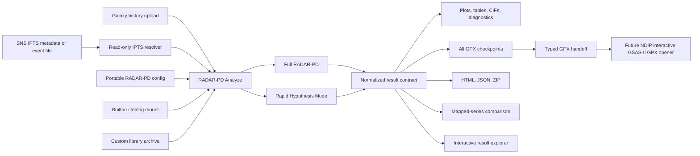

# RADAR-PD on NDIP: Native Integration Design

## Scope

This integration runs RADAR-PD as an NDIP/Galaxy job. It does not call the Birthright VM and it does not start the Streamlit application. Galaxy owns input selection, job execution, history, collections, provenance, reruns, workflow mapping, and output retention. The existing RADAR-PD Full and Rapid scientific pipelines remain the calculation engines.

The implementation is local only at this stage. No container image or Galaxy tool has been pushed.

## Architecture



## Components

### Portable configuration

`scripts/ndip_runner.py configure` creates `radar-pd-config/v1`. The document contains scientific settings and no laptop, VM, API-job, or Galaxy-job paths. It can be generated by the Galaxy configuration tool, by the all-in-one Analyze form, or by a command-line client.

The config covers:

- Full or Rapid mode
- neutron or X-ray measurement
- TOF, CW, or automatic geometry detection
- sample and sample-can/environment chemistry
- fit limits and ignored regions
- background model and term count
- Full-mode search passes and minimum phase fraction
- Rapid-mode phase count and final-refinement shortlist size
- magnetic-ordering precheck
- main-phase cell anchoring, shadow filtering, and optional internal cleanup

### Input routes

Direct Galaxy history input is the default. It accepts a diffraction dataset, instrument profile, and optional main-phase CIF. The built-in laboratory Cu K-alpha instrument preset can replace an uploaded profile for appropriate X-ray data.

SNS IPTS resolution is optional. It accepts either:

1. a NeXus event file from which instrument, IPTS, and run metadata are read, or
2. explicit instrument, IPTS, run, and bank values.

The resolver searches the mounted read-only facility tree for exactly one reduced pattern and one matching instrument profile. Zero matches fail with a useful message. Multiple matches also fail instead of silently choosing the wrong bank or reduction.

### Scientific execution

`scripts/ndip_runner.py analyze` materializes job-local paths into the existing RADAR-PD config builder and calls one of:

- `scripts/gsas_complete_pipeline_nomain.py` for Full RADAR-PD
- `scripts/rapid_hypothesis_pipeline.py` for Rapid Hypothesis Mode

The adapter does not reimplement chemistry filtering, histogram matching, lattice nudging, GSAS-II refinement, main-phase anchoring, phase grouping, or scientific acceptance logic.

### Candidate catalogs

The deployment image does not silently download or embed the large crystallographic catalogs. NDIP should mount a versioned built-in catalog read-only at `/opt/radar-pd/data` and set `RADAR_PD_DATABASE_VERSION`.

The CIF Library Builder returns a portable ZIP and manifest for either:

- `Only my CIFs`, a compact standalone mini catalog
- `Built-in + my CIFs`, an augmented catalog derived from the mounted radiation-specific base

The archive can be stored in Galaxy history and supplied to later Analyze jobs.

### Normalized results

Every analysis returns stable scalar outputs:

- `report.html`
- `summary.json` using `radar-pd-result/v1`
- `state.json` using `radar-pd-state/v1`
- `input_manifest.json`
- `resolved_config.yaml`
- `gpx_index.json`
- `results.zip`
- console log and input-resolution metadata

It also returns Galaxy list collections:

- plots
- result tables
- phase CIFs
- every GPX project/checkpoint
- diagnostics

Files are flattened into collision-resistant collection names while `summary.json` and `gpx_index.json` retain their original run-relative source paths.

### GPX and GSAS-II

RADAR-PD can create a GPX project for a main-phase anchor, pass, hypothesis refinement, accepted/final refinement, rollback, or targeted refinement. All of them are collected rather than returning only one final file.

The local `RADAR-PD GSAS-II Project Handoff` tool selects one project, preserves it as a typed `gpx` Galaxy dataset, and records stage, checkpoint status, size, and SHA-256.

The cloned NDIP repository currently contains a batch GSAS2 Refinement wrapper that creates a new project from diffraction data, instrument parameters, and CIF files. It does not open an existing GPX project and it is not an interactive GSAS-II desktop. Therefore the final editable-GPX connection requires an NDIP administrator to register an interactive GSAS-II image/tool that accepts `gpx`. The handoff boundary is already implemented so no RADAR-PD output redesign is needed later.

### Result exploration

The local interactive Result Explorer serves the normalized report and selected artifact collections through an NDIP interactive-tool entry point. Galaxy history remains the source of truth. The explorer does not alter scientific outputs.

### Series and live acquisition

Galaxy collection mapping is the NDIP-native mechanism for repeated scans:

1. create a list collection of reduced diffraction patterns,
2. map RADAR-PD Analyze across that collection with one versioned config,
3. preserve one independent result bundle per scan,
4. pass the mapped `summary` collection to RADAR-PD Compare Series.

This supports temperature, field, pressure, time, and repeated live-reduction series without introducing a separate RADAR queue or watcher service. An upstream reduction workflow can append or create the pattern collection before RADAR-PD runs.

## Intended NDIP Workflows

### Uploaded one-off analysis

History diffraction + instrument + optional main CIF -> configuration -> Analyze -> report/artifacts -> optional Result Explorer or GPX Handoff.

### IPTS run analysis

Event file or explicit IPTS metadata -> resolver inside Analyze -> Full/Rapid pipeline -> normalized outputs.

### Sequential scan series

Reduced-pattern collection -> mapped Analyze -> summary collection -> Compare Series.

### Custom library analysis

CIF collection -> Library Builder -> custom library ZIP -> Analyze.

### Manual refinement continuation

Analyze GPX collection -> select checkpoint -> GPX Handoff -> future interactive GSAS-II opener.

## Container Contract

Build locally from the RADAR-PD repository:

```bash
docker build -f Dockerfile.ndip -t radar-pd-ndip:local .
docker run --rm radar-pd-ndip:local
```

Galaxy wrappers currently refer to `radar-pd-ndip:local`. Before deployment this must be replaced with an immutable ORNL registry reference, preferably by digest. The deployed job needs:

- a read-only versioned catalog mount
- an optional read-only `/SNS` mount for IPTS mode
- writable ephemeral Galaxy job storage
- no Birthright VM credentials
- no API token for batch execution

The image uses a normal Docker `CMD`, not an `ENTRYPOINT`, so Galaxy can execute its generated Bash command.

## Safety and Reproducibility

- Uploaded data and job work directories are ephemeral Galaxy job inputs.
- `results.zip` and declared Galaxy datasets are retained by Galaxy policy.
- User-supplied database archives reject path traversal before extraction.
- IPTS components accept only safe alphanumeric, underscore, and hyphen tokens.
- Ambiguous facility-file matches fail closed.
- Input files are checksummed in the manifest.
- Result provenance records the RADAR-PD Git commit, container digest, and database version when supplied by the deployment.
- Scientific failures return partial diagnostics and a failed normalized state rather than reporting success.

## Local Validation

```bash
python -m pytest tests/test_ndip_adapter.py -q
python -m py_compile scripts/ndip_contracts.py scripts/ndip_outputs.py scripts/ndip_runner.py
python scripts/ndip_runner.py configure --allowed-elements Cu,P,Pb,O,S --output config.yaml
python scripts/ndip_runner.py analyze --config config.yaml --data pattern.dat --instrument profile.instprm --work-dir work --output-dir portal --dry-run
```

Galaxy XML should be checked with the repository's own test suite and Planemo before any push:

```bash
pixi run pytest tests/test_tool_xml.py
planemo lint tools/neutrons/powder_diffraction/radar_pd_*.xml
```

## Deployment Decisions Still Required

1. ORNL registry project, image name, and immutable tag/digest policy.
2. Versioned neutron and X-ray catalog mount paths.
3. Whether production NDIP jobs may mount `/SNS` directly and which reduced-data layout is supported.
4. CPU, memory, walltime, and concurrency destinations for Full and Rapid jobs.
5. Galaxy datatype registration for `.gpx`.
6. Ownership or source image for an interactive GSAS-II GPX opener.
7. Retention policy for large GPX collections and complete result ZIP files.
8. Prototype-branch permissions, review process, and who is authorized to publish the image.
