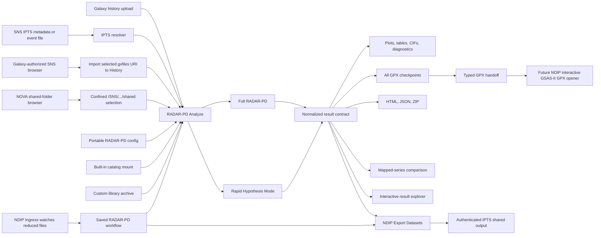

# RADAR-PD on NDIP: Native Integration Design

## Scope

This integration runs RADAR-PD as an NDIP/Galaxy job. It does not call the Birthright VM and it does not start the Streamlit application. For one-off and mapped analyses, Galaxy owns input selection, job execution, history, collections, provenance, reruns, workflow mapping, and output retention. Optional publication composes RADAR-PD with NDIP's installed `Export Datasets` tool, which performs the facility write through NDIP's authenticated execution destination. The existing RADAR-PD Full and Rapid scientific pipelines remain the calculation engines.

The Galaxy batch tools and NOVA interactive client are deployed through the
NDIP prototype environment. RADAR-PD never receives a UCAMS password, OIDC
token, SSH key, or analysis-cluster credential. NDIP owns identity delegation,
job routing, and the write-capable destination. Operating continuous ingress
or watch automation remains an NDIP workflow/deployment responsibility.

## Architecture



## Components

### Identity and facility authorization

UCAMS authentication belongs to NDIP, not to the RADAR-PD container. The user
signs in to NDIP; Galaxy/Pulsar route tools such as `neutrons_export` and
`neutrons_ingress` to destinations that can act with the delegated facility
identity. RADAR-PD composes those installed tools through Galaxy dataset IDs and
validated parameters. It must not prompt for, store, forward, or mount a user's
password, SSH key, browser cookie, OIDC token, or Kerberos credential.

This separation also preserves authorization: a syntactically valid IPTS path
does not grant access. The NDIP destination still decides whether the signed-in
user may read or write that experiment. RADAR-PD reports that tool job's status
without converting an export failure into an analysis failure.

### Portable configuration

`scripts/ndip_runner.py configure` creates `radar-pd-config/v1`. The document contains scientific settings and no laptop, VM, API-job, or Galaxy-job paths. It can be generated by the Galaxy configuration tool, by the all-in-one Analyze form, or by a command-line client.

The config covers:

- Full or Rapid mode
- neutron or X-ray measurement
- TOF, CW, or automatic geometry detection
- sample and sample-can/environment chemistry
- fit limits and ignored regions
- background model and term count
- Full-mode search passes and minimum phase fraction
- Rapid-mode phase count and final-refinement shortlist size
- magnetic-ordering precheck
- main-phase cell anchoring, shadow filtering, and optional internal cleanup

### Input routes

Direct Galaxy History or laptop upload remains available. It accepts a
diffraction dataset, instrument profile, and optional main-phase CIF. The
built-in laboratory Cu K-alpha instrument preset can replace an uploaded
profile for appropriate X-ray data.

For one-off SNS browsing, NOVA uses Galaxy's authenticated remote-file API. The
browser lists only file sources authorized for the current NDIP user, retains
opaque `gxfiles://` URIs, and filters files by scientific role. Diffraction
data, instrument profile, and main-phase CIF are independent selections. Galaxy
imports every selected remote object into the active History before Analyze
runs, so the job consumes immutable History datasets and retains complete
provenance. If a deployment does not expose file sources through the NOVA API
key, the supported fallback is Galaxy **Upload -> Choose remote files**, followed
by selection from **Galaxy History** in the RADAR-PD setup rail.

The NOVA client also contains a direct mounted-storage browser for deployments
that explicitly provide `/SNS` to the interactive pod. It selects an
instrument, an `IPTS-*` experiment, a directory under `shared/`, and then a
role-filtered file. This path is optional and is not inferred merely because
Galaxy batch workers can access `/SNS`.

SNS IPTS resolution is optional. It accepts either:

1. a NeXus event file from which instrument, IPTS, and run metadata are read, or
2. explicit instrument, IPTS, run, and bank values.

The resolver searches the mounted read-only facility tree for exactly one reduced pattern and one matching instrument profile. Zero matches fail with a useful message. Multiple matches also fail instead of silently choosing the wrong bank or reduction.

Both browser routes are distinct from inference-based resolution: the user sees
and chooses the actual reduced file. Galaxy remote-source authorization governs
the primary browser. Any requested export destination is confined to
`/SNS|HFIR/<instrument>/IPTS-*/shared`; traversal and raw-tree destinations are
rejected before the NDIP export job is submitted.

### Scientific execution

`scripts/ndip_runner.py analyze` materializes job-local paths into the existing RADAR-PD config builder and calls one of:

- `scripts/gsas_complete_pipeline_nomain.py` for Full RADAR-PD
- `scripts/rapid_hypothesis_pipeline.py` for Rapid Hypothesis Mode

The adapter does not reimplement chemistry filtering, histogram matching, lattice nudging, GSAS-II refinement, main-phase anchoring, phase grouping, or scientific acceptance logic.

### Candidate catalogs

The deployment image does not silently download or embed the large crystallographic catalogs. NDIP should mount a versioned built-in catalog read-only at `/opt/radar-pd/data` and set `RADAR_PD_DATABASE_VERSION`.

The CIF Library Builder returns a portable ZIP and manifest for either:

- `Only my CIFs`, a compact standalone mini catalog
- `Built-in + my CIFs`, an augmented catalog derived from the mounted radiation-specific base

The archive can be stored in Galaxy history and supplied to later Analyze jobs.

### Normalized results

Every analysis returns stable scalar outputs:

- `report.html`
- `summary.json` using `radar-pd-result/v1`
- `state.json` using `radar-pd-state/v1`
- `input_manifest.json`
- `resolved_config.yaml`
- `gpx_index.json`
- `results.zip`
- console log and input-resolution metadata

It also returns Galaxy list collections:

- plots
- result tables
- phase CIFs
- every GPX project/checkpoint
- diagnostics

Files are flattened into collision-resistant collection names while `summary.json` and `gpx_index.json` retain their original run-relative source paths.

### GPX and GSAS-II

RADAR-PD can create a GPX project for a main-phase anchor, pass, hypothesis refinement, accepted/final refinement, rollback, or targeted refinement. All of them are collected rather than returning only one final file.

The local `RADAR-PD GSAS-II Project Handoff` tool selects one project, preserves it as a typed `gpx` Galaxy dataset, and records stage, checkpoint status, size, and SHA-256.

The cloned NDIP repository currently contains a batch GSAS2 Refinement wrapper that creates a new project from diffraction data, instrument parameters, and CIF files. It does not open an existing GPX project and it is not an interactive GSAS-II desktop. Therefore the final editable-GPX connection requires an NDIP administrator to register an interactive GSAS-II image/tool that accepts `gpx`. The handoff boundary is already implemented so no RADAR-PD output redesign is needed later.

### Result exploration

The local interactive Result Explorer serves the normalized report and selected artifact collections through an NDIP interactive-tool entry point. Galaxy history remains the source of truth. The explorer does not alter scientific outputs.

### Series and live acquisition

Galaxy collection mapping is the NDIP-native mechanism for repeated scans:

1. create a list collection of reduced diffraction patterns,
2. map RADAR-PD Analyze across that collection with one versioned config,
3. preserve one independent result bundle per scan,
4. pass the mapped `summary` collection to RADAR-PD Compare Series.

This supports finite temperature, field, pressure, time, and repeated-reduction
series and is the preferred path when the scan set is already represented as a
Galaxy collection.

For an acquisition folder that receives new reduced files over time, the
preferred NDIP-native design is an Ingress rule that launches a saved workflow:

1. Ingress detects a stable new reduced file and imports it to Galaxy History.
2. The saved workflow runs RADAR-PD with the versioned configuration and fixed
   instrument/main-CIF inputs.
3. `Export Datasets` writes the completed `results.zip` to the selected IPTS
   `shared/` results folder using the user's delegated facility identity.

`scripts/ndip_ipts_watch.py` remains a restart-safe worker implementation for a
future NDIP-managed service or scheduler route. It:

- discovers only configured filename patterns,
- waits for size and modification time to remain stable,
- fingerprints each input and keeps restart-safe atomic state,
- retries failures with configured delay and attempt limits,
- stages outputs in a hidden processing directory,
- atomically renames successful results into a unique per-file directory, and
- preserves numbered failure evidence without overwriting previous runs.

Neither Ingress nor the fallback watcher runs inside the NOVA browser pod. The
automation therefore survives logout, browser closure, and interactive-session
expiry.

## Intended NDIP Workflows

### Uploaded one-off analysis

History diffraction + instrument + optional main CIF -> configuration -> Analyze -> report/artifacts -> optional Result Explorer or GPX Handoff.

### IPTS run analysis

Event file or explicit IPTS metadata -> resolver inside Analyze -> Full/Rapid pipeline -> normalized outputs.

### Galaxy-browsed SNS file analysis

NOVA authorized source -> `gxfiles://` folder -> selected reduced pattern +
independently selected instrument/CIF -> import into Galaxy History -> Analyze
-> report and collections in Galaxy History.

### Direct-mounted IPTS file analysis

NOVA instrument -> IPTS -> shared folder -> selected reduced pattern +
independently selected instrument/CIF -> Galaxy Analyze -> Galaxy history ->
optional authenticated `Export Datasets` job to a selected IPTS output folder.

### Watched acquisition folder

NDIP Ingress -> stable new pattern -> saved Full/Rapid workflow -> normalized
Galaxy outputs -> authenticated result-archive export. A separately operated
watch worker is retained only as a deployment fallback.

### Sequential scan series

Reduced-pattern collection -> mapped Analyze -> summary collection -> Compare Series.

### Custom library analysis

CIF collection -> Library Builder -> custom library ZIP -> Analyze.

### Manual refinement continuation

Analyze GPX collection -> select checkpoint -> GPX Handoff -> future interactive GSAS-II opener.

## Container Contract

Build locally from the RADAR-PD repository:

```bash
docker build -f Dockerfile.ndip -t radar-pd-ndip:local .
docker run --rm radar-pd-ndip:local
```

Galaxy wrappers currently refer to `radar-pd-ndip:local`. Before deployment this must be replaced with an immutable ORNL registry reference, preferably by digest. The deployed job needs:

- a read-only versioned catalog mount
- an optional read-only `/SNS` mount for IPTS browsing/resolution
- writable ephemeral Galaxy job storage
- no Birthright VM credentials
- no API token for batch execution

One-off result publication uses the installed NDIP `neutrons_export` tool.
RADAR-PD passes only the completed Galaxy dataset reference and a validated IPTS
`shared/` destination. NDIP's Pulsar/analysis-cluster destination supplies the
authenticated user context and performs the copy. Continuous processing should
compose NDIP Ingress, a saved RADAR-PD workflow, and the same export tool.

The image uses a normal Docker `CMD`, not an `ENTRYPOINT`, so Galaxy can execute its generated Bash command.

## Safety and Reproducibility

- Uploaded data and job work directories are ephemeral Galaxy job inputs.
- `results.zip` and declared Galaxy datasets are retained by Galaxy policy.
- User-supplied database archives reject path traversal before extraction.
- IPTS components accept only safe alphanumeric, underscore, and hyphen tokens.
- Ambiguous facility-file matches fail closed.
- Facility browsing and output paths are confined to an IPTS `shared/` tree;
  traversal and symlink escapes fail closed.
- One-off IPTS publication is a separate Galaxy job with independent status and
  provenance; an export failure never changes a successful scientific result.
- Export paths include the RADAR-PD run and Galaxy-job suffix so separate runs
  do not target the same result archive.
- Watch state and fingerprints are atomic and restart-safe; unstable files are
  not processed.
- Input files are checksummed in the manifest.
- Result provenance records the RADAR-PD Git commit, container digest, and database version when supplied by the deployment.
- Scientific failures return partial diagnostics and a failed normalized state rather than reporting success.

## Local Validation

```bash
python -m pytest tests/test_ndip_adapter.py -q
python -m py_compile scripts/ndip_contracts.py scripts/ndip_outputs.py scripts/ndip_runner.py scripts/ndip_ipts_watch.py
python scripts/ndip_runner.py configure --allowed-elements Cu,P,Pb,O,S --output config.yaml
python scripts/ndip_runner.py analyze --config config.yaml --data pattern.dat --instrument profile.instprm --work-dir work --output-dir portal --dry-run
```

Galaxy XML should be checked with the repository's own test suite and Planemo before any push:

```bash
pixi run pytest tests/test_tool_xml.py
planemo lint tools/neutrons/powder_diffraction/radar_pd_*.xml
```

## Deployment Decisions Still Required

1. ORNL registry project, image name, and immutable tag/digest policy.
2. Versioned neutron and X-ray catalog mount paths.
3. Production facility-source policy for read-only browsing, plus confirmation
   that the installed `neutrons_export` destination is enabled for RADAR-PD
   workflows on SNS and HFIR.
4. CPU, memory, walltime, and concurrency destinations for Full and Rapid jobs.
5. Galaxy datatype registration for `.gpx`.
6. Ownership or source image for an interactive GSAS-II GPX opener.
7. Retention policy for large GPX collections and complete result ZIP files.
8. Prototype-branch permissions, review process, and who is authorized to publish the image.
9. Ingress ownership, workflow registration, filename matching, and restart/
   monitoring policy for continuous reduced-file processing.
