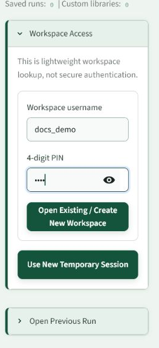

# Workspaces And Sessions

Workspaces are lightweight saved areas for uploaded files, custom CIF libraries, run outputs, and previous configuration values. They are not secure authentication. They are a convenience layer for returning to previous work.

## Workspace Modes

| Mode | What It Does | When To Use |
| --- | --- | --- |
| Temporary session | Creates a short-lived analysis area. | Quick test, demo, or one-off check. |
| Username + 4-digit PIN | Opens or creates a persistent workspace. | Real analysis, saved runs, reusable files, custom CIF libraries. |

## Recommended Policy

Use a persistent workspace for real work. Use a temporary session only when you are testing the app and do not need to retrieve files later.

## Previous Runs

The app stores completed runs in the active workspace. Previous runs can be loaded in two different ways:

- **Open Previous Run**: inspect an old result exactly as it was saved, including plots and tables.
- **Reuse saved run inputs**: copy selected input files into a new run while allowing you to change chemistry, masks, analysis mode, and budgets.

This distinction matters. Opening a previous run is for review. Reusing a previous run is for launching a new analysis.

## What Is Stored

The workspace can contain:

- uploaded diffraction files,
- instrument parameter files,
- optional main phase CIF files,
- run configuration snapshots,
- logs,
- plots,
- tables,
- GPX files,
- rapid hypothesis reports,
- custom CIF libraries.

## Common Mistakes

- Do not assume the 4-digit PIN is security. It is a lookup key.
- Do not use another person's workspace unless they explicitly shared the username and PIN.
- Do not put public-documentation screenshots in a private work area.
- If the browser refreshes, reopen the workspace and load the previous run instead of starting from scratch.

