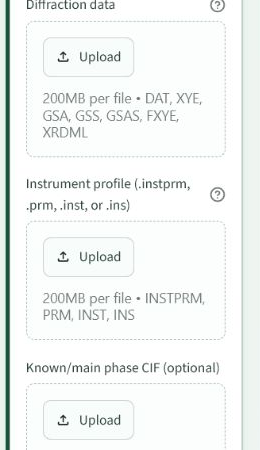

# Input Files

RADAR-PD needs the diffraction signal and enough instrument information to calculate or refine comparable patterns.

## Diffraction Data

Supported data depends on the hosted app version, but the intended user-facing formats are:

| Format | Typical Use |
| --- | --- |
| `.xy`, `.xye`, `.dat` | General powder diffraction signal. |
| `.gsa`, `.fxye` | GSAS-style diffraction input. |
| `.xrdml` | PANalytical / Malvern PXRD workflow. |

If a file is not accepted, convert it to a plain two-column or three-column format and try again.

## Instrument Profile

Instrument information controls peak position, width behavior, and radiation interpretation. Use the file that belongs to the measurement. A neutron TOF file should not be mixed with a laboratory X-ray pattern.

Accepted instrument naming in the UI includes `.instprm`, `.prm`, `.inst`, and `.ins`.

## Known Main Phase CIF

A main CIF is optional but very helpful when you know the dominant phase. With a supplied main phase, RADAR-PD can:

- refine or anchor the main phase,
- subtract the main phase contribution,
- search residual features more intelligently,
- avoid over-crediting impurity candidates that only reproduce main phase peaks.

The main CIF should have the right chemistry and symmetry. If the lattice is slightly off, the app can try lattice anchoring. If the atomic model is poor, expert controls can allow limited internal cleanup.

## CIF Quality

Candidate CIF files should contain:

- a valid unit cell,
- a recognizable space group,
- atomic sites,
- occupancies that make chemical sense,
- no severe parse errors.

If a CIF cannot be attached or refined, the run should report it rather than silently hiding the problem.

## Reusing Saved Inputs

Saved-run reuse copies files into a fresh run folder. This is intentional: a new run should not mutate the previous run's files or results.

Use this when you want to keep the same data but change one part of the analysis, such as chemistry, ignored regions, rapid versus full mode, or number of impurity phases.

