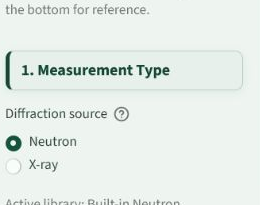
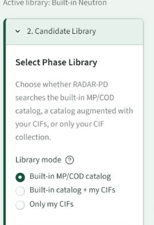
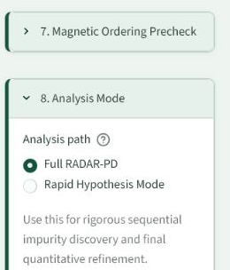

# Setup Options

The left setup panel should be read from top to bottom. Earlier choices change what later controls mean.

## Measurement Type

Choose neutron or X-ray before selecting libraries or uploading files.

| Option | Recommended Default | Change When |
| --- | --- | --- |
| Neutron | Use for neutron diffraction and TOF data. | Your data came from a neutron instrument. |
| X-ray | Use for laboratory or synchrotron PXRD. | Your data is in 2-theta or X-ray Q. |

Scientific reason: neutron and X-ray intensities are not interchangeable. Candidate pattern comparison and refinement behavior depend on the radiation source.

## Candidate Library

| Option | What It Means | Use Case |
| --- | --- | --- |
| Built-in MP/COD catalog | Search the prebuilt catalog for the selected measurement type. | Normal phase search. |
| Built-in catalog + my CIFs | Add your CIF collection to the built-in search. | Known project-specific candidates plus broad search. |
| Only my CIFs | Search only the uploaded custom library. | Controlled screening against a small candidate set. |

## Create Library From CIFs

This section should stay collapsed unless you are building a custom library. It creates a persistent searchable library in the active workspace.

Options:

- **CIF library type**: choose whether the CIFs augment the built-in library or stand alone.
- **Library name**: choose a stable name that describes the sample family or project.
- **Candidate CIF files**: upload one or more CIFs.
- **Overwrite existing pack**: only use this when rebuilding the same library intentionally.

## Data Collection

Provide the measurement files for the run.

Options:

- **Dataset source**: upload new data, use examples, or reuse saved run inputs.
- **Run name**: human-readable run folder. The app can generate a fresh name.
- **Diffraction data**: required for real runs.
- **Instrument profile**: required for real refinement.
- **Known/main phase CIF**: optional but strongly recommended when known.
- **Pattern geometry**: auto, CW, or TOF. Auto is recommended unless the app guesses wrong.

## Chemistry Policy

Use two separate fields:

- **Sample elements**: elements that may belong to the sample phases.
- **Sample can / environment**: elements from holder, can, furnace, cryostat, gasket, or other environment.

Container elements are not freely mixed with sample elements. This matters because Al from a holder should not automatically permit arbitrary Al-O sample phases unless that is scientifically intended.

## Pattern Regions

Ignored regions remove known artifacts from the fitting and scoring domain.

Use ignored regions for:

- detector artifacts,
- beam stop features,
- sample can peaks,
- known substrate peaks,
- unreliable low-angle or high-angle sections.

Use fit-window override only when you want the whole run to consider a specific x-axis range.

## Background Correction

Background controls affect both search quality and refinement stability.

Typical choices:

- **Auto Fixed Points**: good general default for robust setup.
- **Background function**: choose the function appropriate for CW or TOF data.
- **Background terms**: more terms allow more flexibility but can also absorb weak peaks.

Common mistake: using too flexible a background can hide real weak impurity peaks.

## Magnetic Ordering Precheck

If enabled, the app performs a lightweight check for extra peaks that could be indexed by a commensurate magnetic propagation vector. This does not solve a magnetic structure. It only asks whether unexplained peaks look systematic enough to flag before impurity-phase search.

Use it when:

- the main nuclear phase is known,
- extra peaks appear at positions not explained by impurity candidates,
- magnetic ordering is physically plausible for the material.

Do not treat the precheck as proof of magnetic order.

## Analysis Mode

| Mode | Strength | Cost |
| --- | --- | --- |
| Full RADAR-PD | Most rigorous residual-aware workflow. | Longer runtime. |
| Rapid Hypothesis Mode | Fast combination search and focused refinements. | More approximate early ranking. |

## Runtime Budget

This panel applies to Full RADAR-PD. It controls search depth, number of passes, and how aggressively the pipeline spends time on candidate comparison and refinement.

Rapid Hypothesis Mode has its own rapid controls and should not show the full runtime budget controls.

## Expert / Debug Controls

Expert controls are for debugging and method development. They may include:

- main phase anchor cleanup,
- limited Uiso or atomic position cleanup,
- internal benchmark fixtures,
- advanced search and filter settings.

Use these only when the normal defaults fail or when you are deliberately testing a method change.

## Review Run Plan

The review panel summarizes what will be run before you start. Check it carefully. It should include:

- measurement type,
- candidate library,
- data source,
- run folder,
- sample elements,
- can/environment elements,
- pattern geometry,
- background settings,
- analysis mode,
- ignored regions,
- auto masks,
- rapid or full budget parameters.

