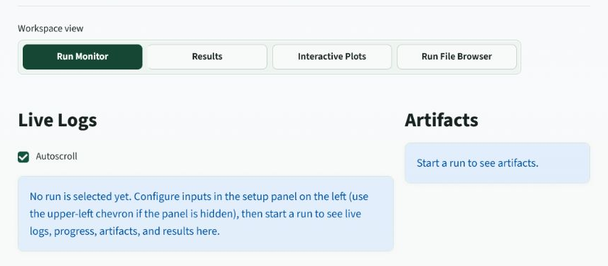

# Full RADAR-PD Workflow

Full RADAR-PD is the rigorous path. It is meant for careful analysis where the app should refine a main phase, evaluate residual peaks, test candidates, and produce inspectable scientific outputs.

## Stage Overview

| Stage | Purpose | What To Watch |
| --- | --- | --- |
| Input and diagnostics | Read files, check GSAS-II readiness, parse chemistry. | Missing files, unsupported formats, bad CIFs. |
| Main phase fit | Fit supplied main CIF if available. | Main phase peaks should align before impurity search. |
| Candidate screening | Use ML and histogram logic to shortlist plausible phases. | Whether expected chemistry appears in candidates. |
| Lattice nudging | Explore small symmetry-respecting lattice changes. | Whether candidate peak positions improve. |
| Pearson/refinement checks | Use more expensive scoring and GSAS-II operations. | Fit quality, phase fractions, failures. |
| Commit and polish | Accept useful phases and refine final model carefully. | Rwp, phase fractions, residual peaks, overfitting. |
| Output packaging | Write plots, tables, GPX, logs, and reports. | Downloadable artifacts and reproducibility files. |

## When To Use Full Mode

Use Full RADAR-PD when:

- the dataset is important,
- weak phases matter,
- a main phase is supplied,
- the result needs a defensible refinement path,
- you need final artifacts for record keeping.

## Main Phase Behavior

When a main CIF is provided, the pipeline should first determine whether the main phase anchors the strongest peaks. If not, lattice anchoring can be triggered. After anchoring, optional internal cleanup can refine limited atomic parameters without changing occupancy.

The intent is simple: do not let impurity candidates steal intensity from a badly aligned main phase.

## Candidate Filtering Around Main Phase Peaks

Candidate phases whose strongest peaks only coincide with the main phase strongest peaks can be filtered or deprioritized. This is useful when an imperfect main phase fit leaves residual artifacts near strong main reflections.

Use this feature carefully. It should remove obvious main-phase shadows, not suppress real impurity phases with genuinely overlapping peaks.

## Live Monitoring

The Run Monitor should show:

- live logs,
- progress stage,
- active run configuration,
- current artifacts,
- final error state if the run fails.

If a run fails, the app should preserve the run folder and show the failure message rather than disappearing.

