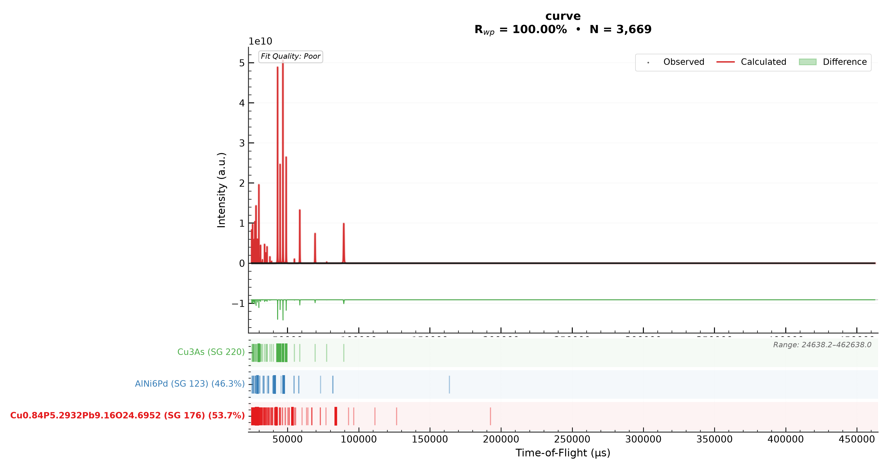

# Results, Plots, And Interpretation

Results are useful only if they can be inspected. RADAR-PD should provide ranked tables, fit plots, residual plots, phase fractions, Bragg tick marks, logs, and reproduction files.

## Primary Outputs

| Output | What It Tells You |
| --- | --- |
| Summary table | Proposed phases, ranking, key scores, phase fractions. |
| Fit plot | Observed versus calculated signal and residual. |
| Bragg tick rows | Where each phase predicts peaks. |
| Strong peak support | Whether the strongest proposed peaks are actually supported by data. |
| GPX file | GSAS-II project for reproduction and deeper inspection. |
| Logs | What happened, including failed candidates and warnings. |
| API config | Reusable job description for batch submission. |

## Reading Fit Plots

The fit plot should make these items visually distinct:

- observed data as scatter points,
- calculated fit as a strong line,
- difference as a separate lower trace,
- background as a muted line,
- phase contributions as distinguishable colored components,
- Bragg ticks in separated rows.

The strongest Bragg peaks of each proposed phase can be drawn thicker. This helps users zoom into the most important reflections and ask: do the expected strong peaks really line up with observed intensity?

## Strong Peak Support

Strong peak support should be written in plain language. For example:

| Label | Meaning |
| --- | --- |
| `3 of 5 strong peaks supported` | Three of the five strongest modeled peaks have observed signal support. |
| `2 strong peaks overlap main phase` | Two important peaks are not independent evidence because they sit on main phase peaks. |
| `1 strong peak overfits background` | The model creates intensity where the observed signal does not support it. |

Avoid compressed labels such as `2+0/5` in user-facing tables.

## When A Result Is Suspicious

Be skeptical when:

- the proposed phase fraction is large but only overlaps main phase peaks,
- a weak phase has no supported strong peaks,
- calculated peaks appear where the observed pattern is flat,
- the background curve absorbs sharp features,
- Rwp improves but residual peak evidence worsens,
- phase fractions collapse to zero or 100 percent without a physical reason.

## Full Versus Rapid Results

Full RADAR-PD results emphasize the rigorous refinement path. Rapid results emphasize a staged hypothesis path. They can disagree. When they do, inspect:

- whether the main phase was anchored,
- whether candidate cells were nudged,
- whether the strongest candidate peaks are supported,
- whether final GSAS-II refinement changed phase fractions substantially,
- whether a grouped representative should be swapped for an alternate variant.

