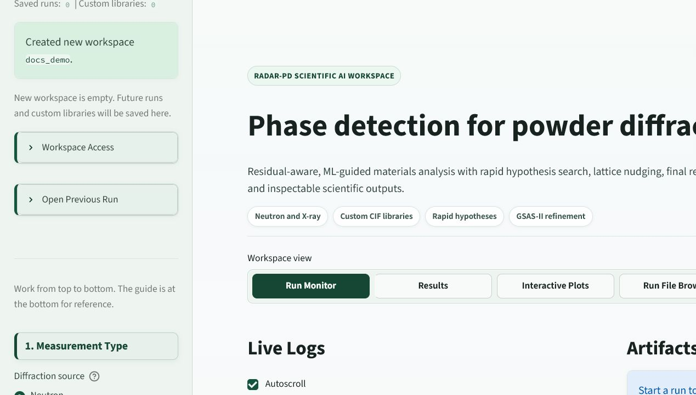

# RADAR-PD Hosted User Manual

This manual is for people using the hosted RADAR-PD web app and API. It explains how to prepare diffraction inputs, choose analysis options, run Full RADAR-PD or Rapid Hypothesis Mode, inspect results, and submit jobs through the API.

It does not describe server administration, VM setup, or developer workflows. The intended user is a diffraction scientist, instrument user, beamline scientist, or collaborator who wants to analyze powder diffraction data through the hosted service.

## What RADAR-PD Does

RADAR-PD helps answer a practical scientific question: when a powder diffraction pattern contains unexplained peaks, which crystalline phases could explain them?

The hosted app supports two complementary analysis paths:

- **Full RADAR-PD**: the more rigorous pipeline. It uses the RADAR-PD search logic, GSAS-II refinements, lattice nudging, residual analysis, and publication-style outputs.
- **Rapid Hypothesis Mode**: a faster hypothesis workflow. It uses histogram matching, lattice-aware nudging, high-resolution pattern scoring, and targeted final refinement ranking.

Both paths use the same input philosophy: choose neutron or X-ray, define candidate chemistry, provide diffraction data and instrument information, optionally provide a known main phase, then inspect the proposed phases and fit quality.

## Hosted Addresses

| Service | URL | Use |
| --- | --- | --- |
| Web app | `http://128.219.184.26:8502/` | Interactive analysis and result inspection. |
| API | `http://128.219.184.26:8501` | Batch submission, polling, and result download. |

Access depends on the ORNL network and the OpenStack security group rules currently applied to the VM.

## Clean Documentation Workspace

Screenshots in this manual are captured from:

| Field | Value |
| --- | --- |
| Username | `docs_demo` |
| PIN | `2468` |

Use this workspace only for documentation examples. Do not put private experimental data in it.

